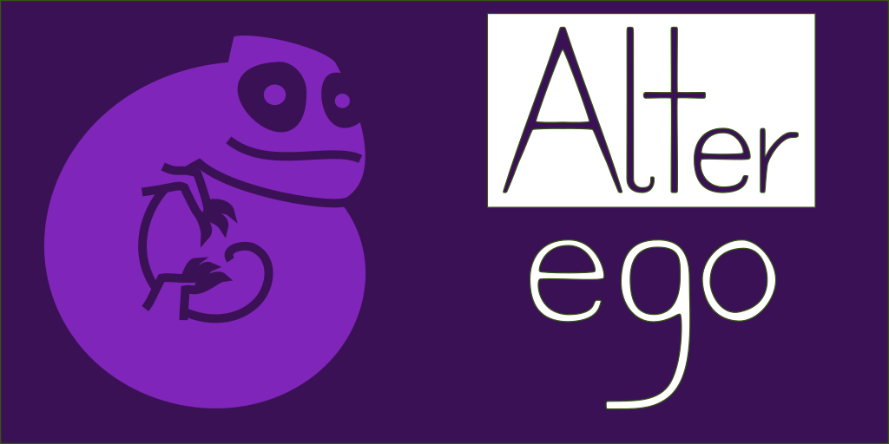

# Alter Ego Discord Bot


Blazingly fast Discord bot written in Rust using Serenity Discord API library, features:
* slow Serenity framework
* simple management tools
* custom commands

## How to use:

### Prerequisites
* `rust` from https://rustup.rs or up to date Docker https://www.docker.com/.
* `libopus-dev` on deb based and `libopus-devel` on rpm based distributions
* `libsodium-dev` on deb based and `libsodium-devel` on rpm based distributions
#### Optionally (for features in voice chat)
* `youtube-dl`
* `ffmpeg`

### Setup

#### First, clone repository and cd into it:
``` bash
git clone https://github.com/LelCP/altego.git
cd altego
```

#### Rust from repositories or rustup.rs:
``` bash
rustup override set stable
cargo build --release
DISCORD_TOKEN=yourtoken ./target/release/lcpae 
```

#### Docker:
``` bash
docker docker pull fuckinlcp/altego
docker volume create lcpae-data
docker run -it -d --name lcpae --restart unless-stopped -v lcpae-data:/root/.lcpae -e DISCORD_TOKEN=yourtoken fuckinlcp/altego
```

Learn more about Docker [here](https://docs.docker.com/get-started/)

#### Automatic updates with Docker using Watchtower:
```
docker run -d --name watchtower -v /var/run/docker.sock:/var/run/docker.sock v2tec/watchtower
```
More [here](https://github.com/v2tec/watchtower)

## License

This project is licensed under the MIT License - see the [LICENSE.md](LICENSE.md) file for details

